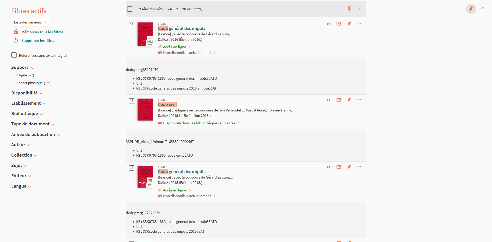

# Primo_show_pnx_sections_in_list_result
Bookmarklet pour afficher des sections de la notice PNX directement dans la liste des résultats.

Pour changer la section à afficher. Modifier la varibale **pnxSection**.

Il est nécessaire d'attendre le chargement total de la page avant de lancer le bookmarklet. 